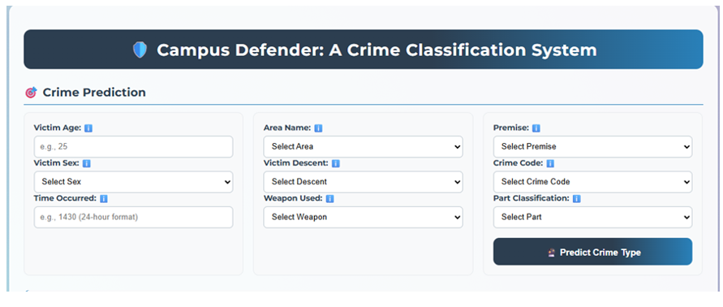
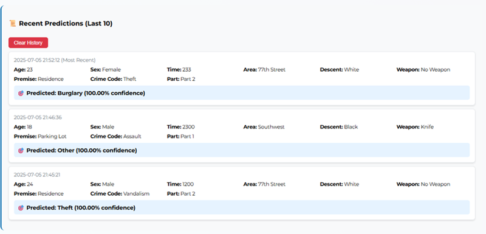
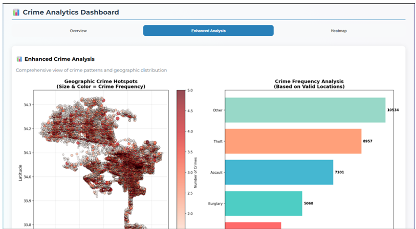

# CrimeSense: Campus Crime Classification Using Machine Learning

## Project Overview

CrimeSense is a machine learning-based system developed to classify campus crime cases based on historical crime data.

The system aims to assist campus management by providing crime prediction and visualization features to support better safety planning and decision-making.

This project applies machine learning techniques for crime classification and provides an interactive interface for users to explore prediction results and crime patterns.

---

## Project Objectives

- To develop a machine learning model for campus crime classification.
- To analyze crime patterns using data visualization techniques.
- To provide an interface for users to perform crime prediction.
- To support campus safety improvement through data-driven insights.

---

## System Interface

### Homepage

### Prediction Page

### Visualization

---

## Machine Learning Model

The model was developed using Python and machine learning algorithms. The complete implementation is available in:

[CrimeSense](campusdefender_enhanced.py)

---

## Project Report

The full project documentation can be found here:

[CrimeSense](ReportCrimeSense.pdf)

---

## Technologies Used

- Python
- Jupyter Notebook
- Machine Learning
- Data Visualization
- GitHub

---

## Project Files

| File | Description |
|---|---|
| CrimeSense_Model.ipynb | Machine learning model implementation |
| CrimeSense_Report.pdf | Project report documentation |
| homepage.png | System homepage screenshot |
| prediction.png | Prediction interface screenshot |
| visualization.png | Data visualization screenshot |

---

## Author
Athirah Mohammad
CrimeSense Project
